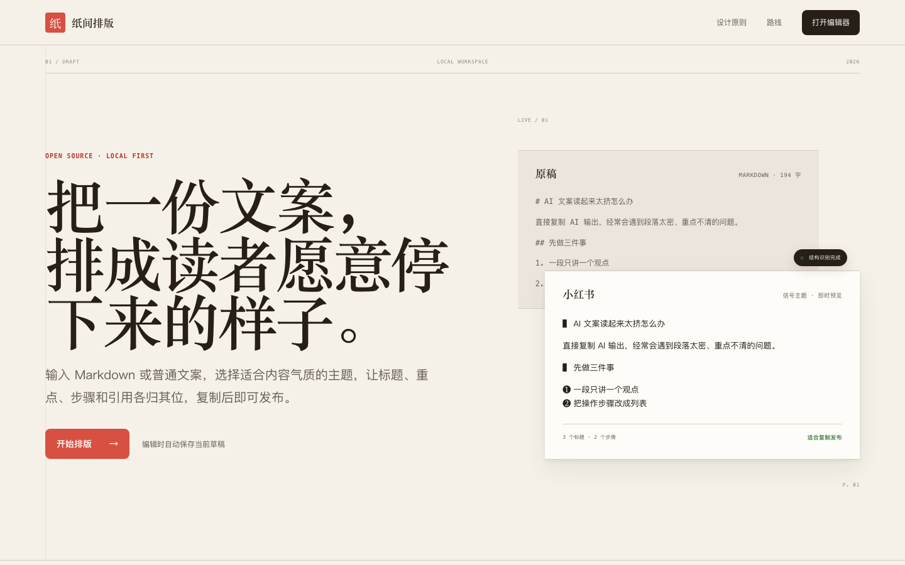

# 纸间排版（Zhijian Copy Studio）

一个开源、本地优先的小红书图文文案排版器。输入 Markdown 或普通文案，即时切换主题、预览并复制可直接发布的纯文本；底层按渠道分离，后续可扩展微信公众号富文本排版。



## 当前能力

- Markdown 与普通文案输入，编辑与预览左右并列
- 清简、信号、纸间、步序四套结构化排版主题
- 步骤教程、实用清单、产品测评三个内容模板
- 标题、列表、任务列表、引用、重点、代码、链接和话题转换
- 字数、段落、标题、话题统计及发布前提示
- 本地自动保存，刷新页面后继续编辑
- 桌面、平板与移动端响应式工作区
- 纯客户端运行，不需要账号、服务端或 API Key

> 当前输出目标是小红书纯文本。微信公众号安全富文本渲染器已预留架构边界，但尚未实现。

## 快速开始

```bash
git clone git@github.com:smilexiaobao1992/zhijian-copy-studio.git
cd zhijian-copy-studio
npm install
npm run dev
```

打开 `http://localhost:4321`，排版工作台位于 `http://localhost:4321/studio/`。

## 排版算法与数据流

纸间排版不是用正则直接替换 Markdown，而是先建立语法树，再由渠道渲染器递归生成目标内容：


### 1. 解析为 mdast

`parseDocument(source)` 使用 `unified`、`remark-parse` 和 `remark-gfm`，返回稳定的文档对象：

```ts
type ContentDocument = {
  schemaVersion: 1;
  source: string;
  ast: Root;
};
```

保留原始 `source`，主题切换只重新渲染 AST，不改写用户输入。`schemaVersion` 为以后迁移本地草稿或扩充文档协议提供版本边界。

### 2. 按源码顺序递归渲染

`renderXiaohongshu(document, theme)` 从根节点开始调用 `renderBlock`，按原文顺序遍历块级节点：

| mdast 节点 | 小红书输出规则 |
| --- | --- |
| `heading` | 根据主题生成标题前缀，再渲染行内内容 |
| `paragraph` | 渲染文字、重点、链接、行内代码等行内节点 |
| `list` / `listItem` | 根据有序、无序、任务状态选择主题标记，并保持嵌套缩进 |
| `blockquote` | 给引用内容的每一行添加主题引用前缀 |
| `table` | 将单元格渲染为以 `｜` 分隔的纯文本行 |
| `code` | 在代码块前添加主题代码标记，再保留代码正文 |
| `thematicBreak` | 输出主题分隔线 |
| `html` | 丢弃 HTML 标签，并记录安全提示 |

行内渲染器支持 `text`、`strong`、`emphasis`、`delete`、`inlineCode`、`break`、`link`、`image` 和脚注节点。链接保留可见文字和 URL；图片退化为可读的图片说明，不尝试上传或嵌入资源。

### 3. 主题是经过校验的规则对象

主题不是一组页面颜色，而是一份可执行的排版协议。所有主题都必须通过 Zod 的 `xhsThemeSchema` 校验，包括标题、列表、引用、分隔线、强调和代码标记：

```ts
{
  heading: { style: 'symbol', symbol: '▌' },
  unorderedBullet: '→',
  orderedStyle: 'filled',
  quotePrefix: '⌁ 提示｜',
  divider: '— · — · —'
}
```

这种设计让新增主题只需要提供规则数据并补充输出断言，无需修改解析器或编辑器组件。

### 4. 输出归一化

块级结果先用两个换行连接，然后依次：

1. 删除换行前的尾随空格；
2. 将三个及以上连续换行压缩为两个；
3. 清理首尾空白。

最终始终得到适合复制到内容平台的普通文本，不混入页面 HTML 或隐藏样式。

### 5. 统计与发布提示

渲染完成后计算字符数、标题数、段落数和话题数，并针对以下情况给出提示：内容为空、字符数超过 1000、第一行超过 28 个字符、话题超过 10 个，或原文包含已被移除的 HTML。

这些是编辑辅助信息，不会阻止复制，也不会擅自修改文案。

### 复杂度

设 AST 节点与文本总量为 `n`，树深为 `d`：解析、HTML 检查、递归渲染与统计都是线性遍历，整体时间复杂度为 `O(n)`；输出及 AST 占用 `O(n)` 空间，递归调用栈为 `O(d)`。

## 为什么后续能扩展公众号

解析层只负责把输入变成通用 mdast，渠道差异集中在独立渲染器中：

```text
Markdown ──> mdast ──┬──> render-xhs.ts     ──> 纯文本
                     └──> render-wechat.ts  ──> 安全内联样式 HTML（规划中）
```

未来新增 `render-wechat.ts` 时可以直接复用解析器与 mdast 文档树。编辑器外壳和内容模板也可以继续使用，但结果类型、主题协议、预览组件与渠道切换需要通过统一的 `ChannelAdapter` 接入，不能只增加一个渲染文件。公众号渲染器在发布前还必须增加 HTML 标签与样式白名单、URL 校验和净化流程；在这些安全边界完成前，项目不会把原始 HTML 直接输出。

## 技术架构

| 层级 | 技术与职责 |
| --- | --- |
| 页面外壳 | Astro：静态首页、路由和轻量页面装配 |
| 编辑器 | React Island：输入、主题、模板、预览与复制交互 |
| 文档核心 | TypeScript + unified/remark：解析 mdast 和渠道渲染 |
| 主题协议 | Zod：运行时校验主题配置与本地草稿结构 |
| 性能策略 | `useDeferredValue` + `useMemo`：避免输入时重复计算 |
| 本地存储 | `localStorage`：420ms 防抖保存，不上传文案 |
| 样式系统 | CSS Modules + 全局设计 Token |
| 质量保障 | Vitest + Astro Check + Playwright |

选择 mdast 而不是自行实现字符串解析，是为了保留标准 Markdown 语义，并让小红书纯文本与公众号富文本共享同一棵文档树。

## 项目结构

```text
docs/                     README 截图等仓库资料
src/core/                 文档解析、主题协议、小红书渲染器与测试
src/features/editor/      React 编辑工作台、模板和本地草稿
src/layouts/              SEO/GEO 元数据与页面壳
src/pages/                Astro 页面、静态路由与发现文件
src/styles/               全局 Token 与页面样式
tests/e2e/                桌面与移动端关键流程测试
```

## 开发与验证

| 命令 | 用途 |
| --- | --- |
| `npm run dev` | 启动本地开发服务器 |
| `npm run test` | 运行核心单元测试 |
| `npm run check` | 执行 Astro / TypeScript 检查 |
| `npm run build` | 类型检查并构建生产版本 |
| `npm run verify` | 依次运行单元测试和生产构建 |
| `npm run test:e2e` | 运行桌面与移动端 Playwright 测试 |

首次运行端到端测试需要安装 Chromium：

```bash
npx playwright install chromium
npm run test:e2e
```

如果测试目标不是默认本地地址，可设置 `PLAYWRIGHT_BASE_URL`。

## 部署与 SEO/GEO

生产构建前必须提供最终公开域名，canonical、Open Graph URL、结构化数据、`robots.txt` 和 `sitemap.xml` 都会从同一个地址生成：

```bash
SITE_URL=https://example.com npm run build
```

部署平台应将 `SITE_URL` 设置为不含路径的站点根地址。项目同时提供面向搜索引擎的 JSON-LD、面向 AI 检索的 `/llms.txt`，以及标准 `/robots.txt`、`/sitemap.xml`。域名未配置时，本地构建仍可运行，但不会输出可能错误的 canonical URL。

## 设计与隐私边界

- 主题只改变输出，不修改原始文案。
- 小红书结果是普通文本，不声称平台支持真正的颜色、字号或粗体。
- 原始 HTML 会被移除，不进入复制结果。
- 草稿仅保存在当前浏览器的 `localStorage`。
- 当前版本不自动发布、不上传文案、不接入 AI 或违禁词接口。

视觉系统和响应式规则见 [DESIGN.md](./DESIGN.md)，主题贡献方式见 [CONTRIBUTING.md](./CONTRIBUTING.md)。

## Roadmap

- 微信公众号安全富文本渲染器
- 更多可组合主题与内容模板
- 主题配置导入、导出与社区共享

## License

[MIT](./LICENSE)
