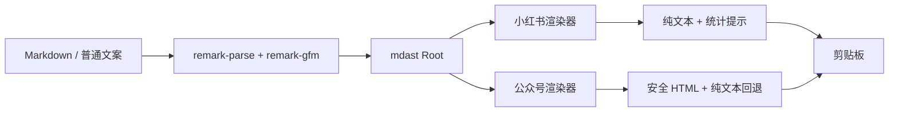

# 纸间排版（Zhijian Copy Studio）

一个开源、本地优先的小红书与微信公众号文案排版器。输入 Markdown 或普通文案，即时切换渠道和主题，复制可直接发布的小红书纯文本或公众号富文本。


## 当前能力

- Markdown 与普通文案输入，桌面左右并列，紧凑屏幕切换编辑与预览
- 清简、信号、纸间、步序、元气、简报、札记、问答八套结构化排版主题
- 小红书本地结构体检与一键整理，可撤销原始文案
- 小红书标题、正文、话题分区复制与整篇复制
- 微信公众号“编辑部手记”富文本主题与样式工坊
- 8 套版式气质、7 种标题样式，可调字体、字号、行距、主题色和代码样式
- 公众号可用 `==重点==` 添加选择性朱砂下划线，小红书输出会自动移除标记符号
- 步骤教程、实用清单、产品测评三个内容模板
- 标题、列表、任务列表、引用、重点、代码、表格、行内/引用式链接、图片说明、脚注和话题转换
- 字数、段落、标题、话题统计；小红书按最终发布文本执行 1000 字门禁
- 本机笔记库：新建、切换、搜索、改名、复制和删除多篇内容
- 本地自动保存，刷新页面后继续编辑；支持 JSON 备份导入、导出
- 桌面、平板与移动端响应式工作区
- 纯客户端运行，不需要账号、服务端或 API Key

公众号输出使用经过约束的内联样式 HTML，剪贴板同时写入 `text/html` 与 `text/plain`，可直接粘贴到公众号编辑器继续调整。


<details>
  <summary>查看 375px 移动端公众号预览</summary>
  
</details>

## 快速开始

```bash
git clone git@github.com:smilexiaobao1992/zhijian-copy-studio.git
cd zhijian-copy-studio
npm install
npm run dev
```

打开 `http://localhost:4321`，排版工作台位于 `http://localhost:4321/studio/`。

## 排版算法与数据流

纸间排版不是用正则直接替换 Markdown，而是先建立语法树，再由渠道渲染器递归生成目标内容：



### 1. 解析为 mdast

`parseDocument(source)` 使用 `unified`、`remark-parse` 和 `remark-gfm`，返回稳定的文档对象：

```ts
type ContentDocument = {
  schemaVersion: 1;
  source: string;
  ast: Root;
};
```

保留原始 `source`，主题切换只重新渲染 AST，不改写用户输入。为贴合中文文案习惯，只有 `> 引用`（大于号后有空白）会被识别为引用，`>100`、`>>` 等紧邻写法保留为普通符号。`schemaVersion` 为以后迁移本地草稿或扩充文档协议提供版本边界。

### 2. 按源码顺序递归渲染

小红书会先用确定性的本地规则检查段落密度、Markdown 标题和 Emoji 小标题信号。用户主动点击“整理结构”后，工具才会把双空格、视觉小标题和长段落转换成带留白的 Markdown，原文保留在一次撤销状态中，不调用云端 AI。若检测到列表、引用、表格、代码或其他依赖连续行的 Markdown 结构，整理器会保留原文并停止自动重写。

`renderXiaohongshu(document, theme)` 再从根节点开始调用 `renderBlock`，按原文顺序遍历块级节点：

| mdast 节点 | 小红书输出规则 |
| --- | --- |
| `heading` | 根据主题生成标题前缀，再渲染行内内容 |
| `paragraph` | 渲染文字、重点、链接、行内代码等行内节点 |
| `list` / `listItem` | 根据有序、无序、任务状态选择主题标记，并保持嵌套缩进 |
| `blockquote` | 给引用内容的每一行添加主题引用前缀 |
| `table` | 将单元格渲染为以 `｜` 分隔的纯文本行 |
| `code` | 在代码块前添加主题代码标记，再保留代码正文 |
| `thematicBreak` | 输出主题分隔线 |
| `definition` | 建立引用式链接和图片的定义索引，不单独输出定义行 |
| `footnoteDefinition` | 只输出正文已引用的脚注，按首次引用顺序在文末追加 |
| `html` | 丢弃 HTML 标签，并记录安全提示 |

行内渲染器支持 `text`、`strong`、`emphasis`、`delete`、`inlineCode`、`break`、`link`、`linkReference`、`image`、`imageReference` 和脚注引用。完整式、折叠式和快捷式引用链接都通过定义索引解析；链接保留可见文字和 URL，图片退化为可读的图片说明，不尝试上传或嵌入资源。

公众号由 `renderWechat(document, theme, styleConfig, assets)` 遍历同一棵 mdast，生成带内联样式的标题、段落、步骤、引用、表格、代码块和脚注。`theme` 定义安全的基础视觉协议，`styleConfig` 只允许经过 Zod 校验的字体、字号、行距、六位十六进制主题色、标题样式和代码明暗。用户文字先进行 HTML 转义，行内链接与引用式链接都只允许 `http`、`https`、`mailto`、`tel` 和页内锚点协议；除用于表格换行的单个 `<br>` 外，原始 HTML 一律丢弃。编辑器支持选择图片或把剪贴板图片直接粘进 Markdown；图片保存在浏览器 IndexedDB，预览与复制时才通过受控的 `assets` 映射还原成自包含 ``。远程图片仍只保留为插图位置说明，不在预览阶段加载。

### 3. 主题是经过校验的规则对象

主题不是一组页面颜色，而是一份可执行的排版协议。小红书主题通过 Zod 的 `xhsThemeSchema` 校验，包括标题、列表、引用、分隔线、强调和代码标记：

```ts
{
  heading: { style: 'symbol', symbol: '▌' },
  unorderedBullet: '→',
  orderedStyle: 'filled',
  quotePrefix: '⌁ 提示｜',
  divider: '— · — · —'
}
```

公众号主题通过 `wechatThemeSchema` 校验颜色、标题标签、引用标签和分隔符，用户微调则通过 `wechatStyleConfigSchema` 校验。两者都只能提供经过验证的数据，不能注入标签或任意样式；HTML 结构始终由渲染器掌握。

### 4. 输出归一化

块级结果先用两个换行连接，然后依次：

1. 删除换行前的尾随空格；
2. 将三个及以上连续换行压缩为两个；
3. 清理首尾空白。

小红书最终得到普通文本，并从同一结果中拆分出标题、正文和话题，可分别复制或整篇复制。公众号同时得到安全 HTML 和归一化纯文本，分别作为剪贴板的富文本与回退格式。

### 5. 统计与发布提示

两个渠道都会计算字符数、标题数、段落数和话题数。小红书会针对内容为空、段落过密、视觉小标题尚未结构化、字符数超过 1000、第一行超过 28 个字符、话题超过 10 个和原始 HTML 给出提示；超过 1000 字时会显示超出数量并禁止“复制全部”，标题、正文和话题只有各自不超过 1000 字时才可分区复制。公众号则提示空内容、已移除的原始 HTML、图片插入位置和不安全链接协议，不受小红书字数门禁影响。

除小红书 1000 字发布门禁外，这些提示不会阻止复制，也不会擅自修改文案。

### 6. 多笔记存储与迁移

编辑器把工作区保存为 `schemaVersion: 2`，每条笔记独立保存原文、渠道、双渠道主题和公众号样式。工作区同时维护递增 `revision`；切换笔记或修改内容后经过 420ms 防抖写入 `localStorage`，刷新、离开页面或切到后台时尝试立即补存。写入前比较浏览器当前快照与本页上次成功保存的完整快照，而不是仅比较本地编辑次数。发生冲突后继续输入也不会绕过检查；当前内容仍留在编辑器，可先导出备份再刷新。浏览器强制结束进程等不触发页面事件的情况不保证补存成功。

首次加载会优先读取 `social-copy-studio:workspace:v2`。只有 V2 键确实不存在时，才读取旧版 `social-copy-studio:draft:v1` 并在内存中迁移为一条笔记，旧键仍保留用于回退。V2 存在但损坏时停止自动保存并进入备份恢复状态，原始存储值不会被默认稿覆盖。JSON 备份带应用标识、备份版本和完整工作区，导入与导出统一按 UTF-8 字节计算 20 MB 上限；读取文件前也会检查大小。导入再校验应用标识、结构、时间戳和活动笔记，最后经用户确认替换当前数据。超过限制的导出会明确报错，不会生成无法导回的文件。笔记与备份始终留在浏览器和用户下载的文件中，不经过服务端。

### 复杂度

设 AST 节点与文本总量为 `n`，树深为 `d`：解析、HTML 检查、递归渲染与统计都是线性遍历，整体时间复杂度为 `O(n)`；输出及 AST 占用 `O(n)` 空间，递归调用栈为 `O(d)`。设工作区有 `m` 条笔记、全部笔记文本总量为 `s`，不可变更新需要 `O(m)`，搜索与 JSON 导入导出需要 `O(s)`。

## 双渠道架构

解析层只负责把输入变成通用 mdast，渠道差异集中在独立渲染器中：

```text
Markdown ──> mdast ──┬──> render-xhs.ts     ──> 纯文本
                     └──> render-wechat.ts  ──> 安全内联样式 HTML
```

两个渲染器共享解析器、mdast 文档树、编辑器和内容模板，但保留各自的结果类型、主题协议与复制方式。编辑器只计算当前渠道的结果，小红书写入纯文本，公众号写入富文本和纯文本两种 MIME。新增渠道时无需改变 Markdown 解析规则。

## 技术架构

| 层级 | 技术与职责 |
| --- | --- |
| 页面外壳 | Astro：静态首页、路由和轻量页面装配 |
| 编辑器 | React Island：输入、主题、模板、预览与复制交互 |
| 文档核心 | TypeScript + unified/remark：解析 mdast 和渠道渲染 |
| 主题协议 | Zod：运行时校验主题配置与本地草稿结构 |
| 性能策略 | `useDeferredValue` + `useMemo`：避免输入时重复计算 |
| 本地存储 | `localStorage`：多笔记 V2、旧稿迁移、420ms 防抖与 JSON 备份 |
| 样式系统 | CSS Modules + 全局设计 Token |
| 质量保障 | Vitest + Astro Check + Playwright |

选择 mdast 而不是自行实现字符串解析，是为了保留标准 Markdown 语义，并让小红书纯文本与公众号富文本共享同一棵文档树。

## 项目结构

```text
docs/                     README 截图等仓库资料
src/core/                 文档解析、双渠道主题协议、渲染器与测试
src/features/editor/      React 编辑工作台、模板和本地草稿
src/layouts/              SEO/GEO 元数据与页面壳
src/pages/                Astro 页面、静态路由与发现文件
src/styles/               全局 Token 与页面样式
tests/e2e/                桌面与移动端关键流程测试
```

## 开发与验证

| 命令 | 用途 |
| --- | --- |
| `npm run dev` | 启动本地开发服务器 |
| `npm run test` | 运行核心单元测试 |
| `npm run check` | 执行 Astro / TypeScript 检查 |
| `npm run build` | 类型检查并构建生产版本 |
| `npm run verify` | 依次运行单元测试和生产构建 |
| `npm run test:e2e` | 运行桌面与移动端 Playwright 测试 |

首次运行端到端测试需要安装 Chromium：

```bash
npx playwright install chromium
npm run test:e2e
```

如果测试目标不是默认本地地址，可设置 `PLAYWRIGHT_BASE_URL`。

## 部署与 SEO/GEO

默认正式域名为 `https://zhijian.yaoyiqian.com`，canonical、Open Graph URL、结构化数据、`robots.txt` 和 `sitemap.xml` 都会从同一个地址生成。如需部署到其他域名，可在构建时覆盖：

```bash
SITE_URL=https://example.com npm run build
```

`SITE_URL` 应为不含路径、查询参数、片段或认证信息的 http(s) 站点根地址；错误格式会阻止构建，未设置或留空时使用默认正式域名。项目同时提供面向搜索引擎的 JSON-LD、面向 AI 检索的 `/llms.txt`，以及标准 `/robots.txt`、`/sitemap.xml`。正式发布前检查首页 canonical 和站点地图中的域名一致。

## 设计与隐私边界

- 主题只改变输出，不修改原始文案。
- 小红书结果是普通文本，不声称平台支持真正的颜色、字号或粗体。
- 公众号结果只包含渲染器生成的标签与内联样式，用户原始 HTML 不会透传。
- 原始 HTML 会被移除，不进入复制结果。
- 笔记仅保存在当前浏览器的 `localStorage`，本地图片保存在 IndexedDB，不会在不同浏览器或设备间自动同步。
- 可导出 JSON 备份，在另一浏览器手动导入；导入会替换当前浏览器里的整套笔记。当前 JSON 备份不包含图片文件，跨浏览器迁移时需重新插图。
- 当前版本不自动发布、不上传文案、不接入 AI 或违禁词接口。

视觉系统和响应式规则见 [DESIGN.md](./DESIGN.md)，主题贡献方式见 [CONTRIBUTING.md](./CONTRIBUTING.md)。

## Roadmap

- 更多公众号主题与段落组件
- 本地图片随 JSON 备份导出与恢复
- 更多可组合主题与内容模板
- 主题配置导入、导出与社区共享

## License

[MIT](./LICENSE)
